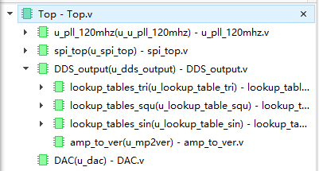
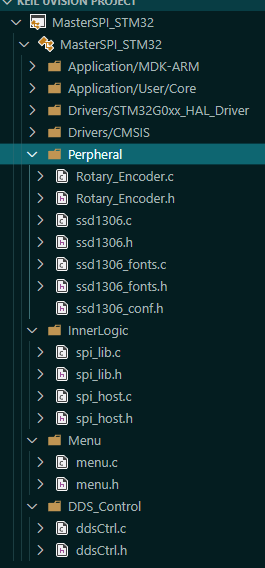
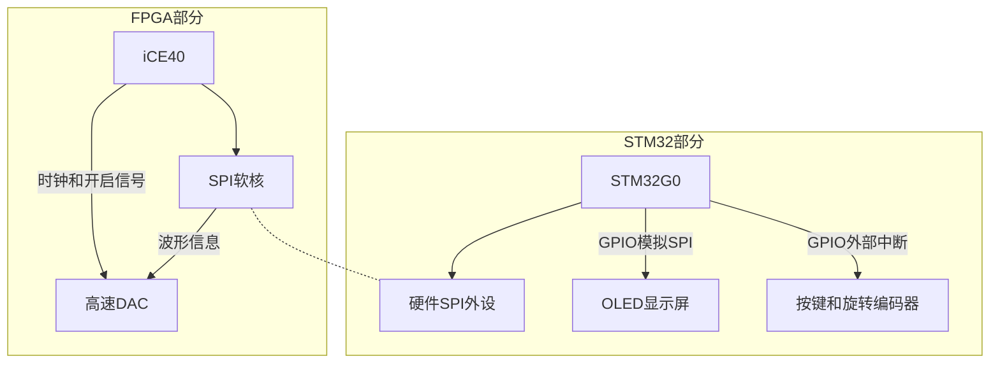
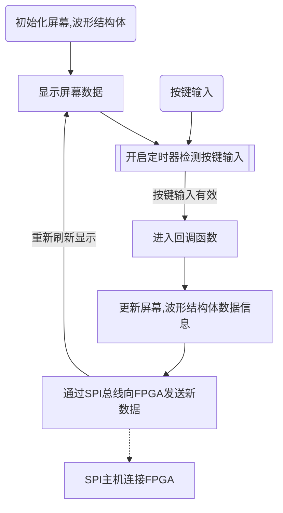
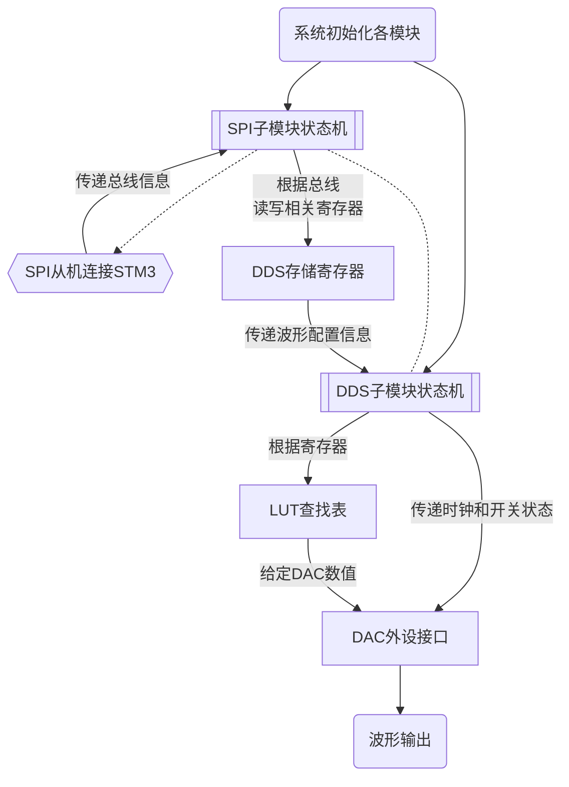
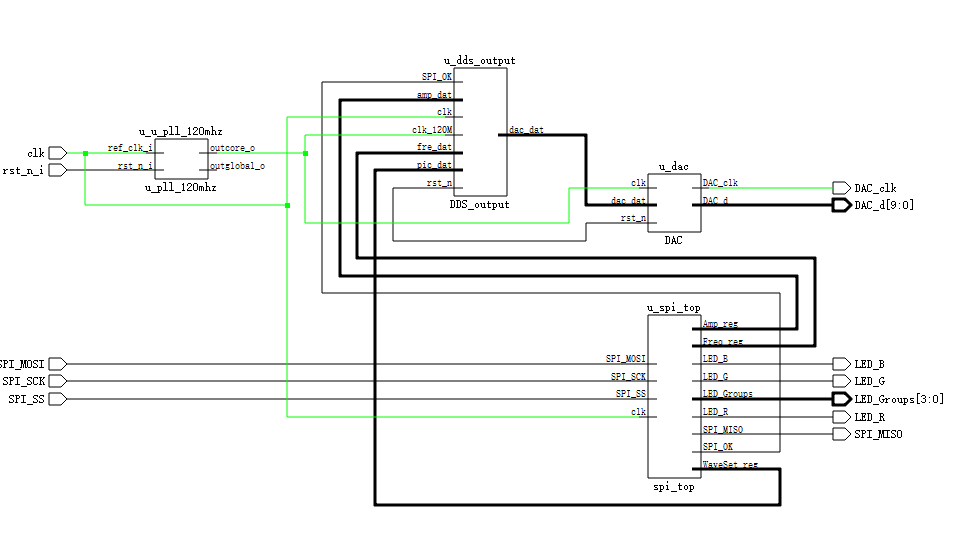
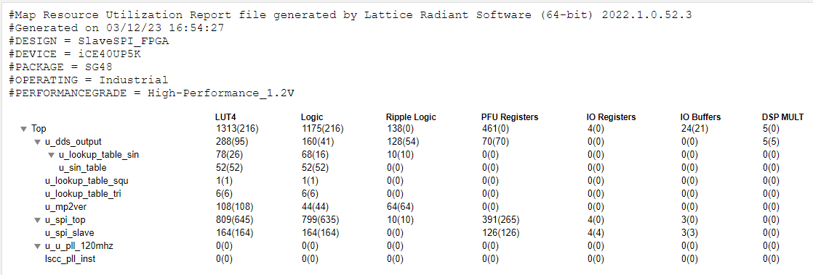

<!--

 * @Description: 
 * @Author: MALossov
 * @Date: 2023-03-07 21:31:45
 * @LastEditTime: 2023-03-09 21:11:35
 * @LastEditors: MALossov
 * @Reference: 
-->
# 2023寒假在家练 - 基于STM32+iCE40的电赛训练平台实现的本地控制的DDS信号发生器

[TOC]

> 特别鸣谢：没有开源、过往项目的支持，我无法完成这个项目：
>
> 1. [afiskon/stm32-ssd1306](https://github.com/afiskon/stm32-ssd1306.git)
> 2.  [damdoy/ice40_ultraplus_examples](https://github.com/damdoy/ice40_ultraplus_examples)
> 3. [基于小脚丫FPGA的电赛训练平台](https://www.eetree.cn/project/detail/251)

## 一、项目介绍

本次使用的项目使用基于STM32+iCE40的电赛训练平台完成。
本次使用的板卡载有ICE40UP5K FPGA和STM32G031 MCU，使用FPGA控制高速DAC产生波形，使用MCU控制OLED屏幕和读取按键、旋转编码器输入并进行处理。
完成的任务为：

**项目3 - DDS任意波形发生器/本地控制**

1. 通过板上的高速DAC（10bits/最高125Msps）配合FPGA内部DDS的逻辑（最高48Msps），生成波形可调（正弦波、三角波、方波）、频率可调（DC-）、幅度可调的波形
2. 生成模拟信号的频率范围为DC-5MHz，调节精度为1Hz
3. 生成模拟信号的幅度为最大1Vpp，调节范围为0.1V-1V
4. 在OLED上显示当前波形的形状、波形的频率以及幅度
5. 利用板上旋转编码器和按键能够对波形进行切换、进行参数调节

## 二、设计思路

### 总览

1. 本次的设计主要分为两部分，一部分是FPGA部分，一部分是MCU部分。
   1. FPGA部分：
   
      
   
      1. 参考开源代码设计SPI软核，与STM32进行交互，实现FPGA与MCU的通信。
      2. 使用LUT查找表进行FPGA相关的计算，实现DDS的逻辑。通过添加多张查找表实现多种波形的生成。
      3. 通过将查找表的值进行位运算并且补齐，产生输出信号，实现高速DAC的输出和幅度调节。
      4. 使用LED灯指示FPGA的工作状态。
   
   2. MCU部分：
   
      
   
      1. 使用2个定时器进行旋转编码器的读取，实现旋转编码器的输入。为旋转编码器和按键添中断，实现按键的输入和准确的读取，并且不影响主程序。
      2. 自行添加显示结构体，实现OLED的显示框架设置，避免频繁地调用底层函数，同时通过结构体方便进行显示的刷新和显示的管理。
      3. 使用SPI与FPGA进行通信，实现FPGA与MCU的通信。为SPI通信编制协议和编解码函数，实现数据的传输、校验等。

### SPI通信部分

> 由于代码太长，这里暂时不放出状态机代码，详细代码请见以下部分和附件。

1. SPI通信协议如下：将通信分为4个byte，首位CMD位，仅由STM32主机向FPGA从机发送，第二、三、四位均为数据位，通过读取CMD位，借助SPI全双工的优势，在剩下的3位当中可以进行读取、写入等操作：

    | byte  |   0   |   1   |   2   |   3   |
    | :---: | :---: | :---: | :---: | :---: |
    | 命令  | 数据  | 数据  | 数据  | 数据  |
2. 实现指令的逻辑为：由两部分实现一整个SPI的子模块，
   1. 一个模块为SPI的具体逻辑模块：负责实现MISO和MOSI总线上的操作，由SCLK线上升沿决定下一个状态该如何操作，具体操作为：当SCLK上升沿时，若为主机发送数据，则将数据从MOSI总线上读取，若为从机发送数据，则将数据从MISO总线上读取，同时将数据写入到SPI的寄存器中，以便于主机读取。
   2. 另一个模块为SPI顶层模块，由一个状态机先判断收到的8位是否为特定CMD位，若为特定CMD位，则根据CMD位的值进行相应的操作，若不为CMD位，则根据状态机的状态进行相应的操作。
   3. 如下为我实现的指令：

    | 命令  |                                                   功能                                                   |
    | :---: | :------------------------------------------------------------------------------------------------------: |
    | 0x00  |                                   空指令，什么也不做，即略过剩下的操作                                   |
    | 0x01  |                                 初始化SPI通信，状态机由IDLE转为WAIT_CMD                                  |
    | 0X02  |                  向FPGA写入后24位并且取反(~)，将MOSI总线上读到的数据位移存储到寄存器中                   |
    | 0X03  |                     从FPGA读出写入的24位地址，将寄存器中的数据位移由MISO取最高位发送                     |
    | 0X04  |              通过SPI改变FPGA板上灯的颜色，即读取MOSI位移数据中最后三位并赋值给连接LED的REG               |
    |  0x5  |                        读取LED状态，即为将LED REG当中的值写入发送寄存器的最后一位                        |
    |  0x6  | 接下来连续发送4*24位的数据(CMD位留空并调用4次发送)；即后四次FPGA均为读出寄存器数组数据，并位移由MISO发送 |
    |  0x7  |    接下来连续读入4*24位的数据(CMD位留空并调动4次接收)；即后四次FPGA均为读入数据，并存入对应寄存器数组    |

    > 0x6 和 0x7 命令的目标是发送和接收分段为多个的值 尽可能快地打包。由于数据以最快的方式发送，因此在 fpga 端，这是寄存器上的测试，指示 空闲缓冲区，在主机端，这是对发送的元数据的测试 SPI 数据包。
    > 此实现的一大缺点是主机必须发送读取请求 然后通过在SPI线路上发送NOP来读取数据。改进可能是做 请求和阅读同时进行，但我们希望保持简单。

3. SPI的校验：借助全双工总线，当主机读取SPI数据包时，前三个字节是数据 最后一个字节是状态字节，它只有七位。(即为：在MISO总线上，数据的排列为先数据，后状态，他们的含义为：`bit 7 - 数据已经成功从FPGA被写出；bit 6 - 数据已经从FPGA被写入`)因此，在主机检验时，只需要检验最后一位byte即可，并在读出和读入指令时校验值并不相同，例如，检验主机写入从机时，检测函数为：`#define STATUS_FPGA_RECV_MASK (0x1<<STATUS_FPGA_RECV_OFFSET) //OFFSET为6`。如果校验失败，则进行重新发送指令即可。

4. 借助这些基础函数，我们可以向FPGA中新建新的指令（即为开辟新的寄存器并存入数据），实现快速存入/读取频率、幅度、波形信息；并且封装为C语言函数由STM32实现。接下来，发送波形部分则可以直接对齐这些寄存器地址即可实现。

### OLED显示部分

1. OLED显示部分考虑到由于没有硬件SPI的加持，因此使用了软件SPI，即通过GPIO模拟SPI总线。具体实现为通过位运算和FOR循环改变MISO的电平，从而实现SPI的通信。具体实现类似为：

   ```c
    void OLED_WriteByte(uint8_t dat)
    {
        uint8_t i;
        for(i=0;i<8;i++)
        {
            OLED_SCLK_L;
            if(dat&0x80)
                OLED_SDIN_H;
            else
                OLED_SDIN_L;
            OLED_SCLK_H;
            dat<<=1;
        }
    }
   ```

2. 底层通信实现后，发现由于底板设计原因，GPIO速率太快时，OLED显示屏容易出现闪屏、显示失位的问题，通过阅读SSD1306的手册和常见驱动，最终选择了一款能够较为轻易实现全刷新的驱动，实现的方法为：**将屏幕内容保存在MCU的本地数组中，每次全刷新屏幕时，将数组的全部内容写入OLED中这样可以实现115Hz的全刷新率，远远高于使用中景园驱动！！！**
   1. 而如果使用中景园驱动，由于其采用的是分屏刷新，因此刷新率只有30Hz左右，且由于其采用的是分屏刷新，因此在刷新时更容易会出现闪屏的情况，因此，我们选择了一种更为轻易实现的方法，即为全屏刷新。同时由于本地保留了全部的屏幕信息，因此可以通过一次全刷新指令，实现屏幕的清屏操作；而不用通过重新发送全部的初始化指令。

3. 结构体封装：
   1. 以标题封装为例，我们将标题封装为一个字符串指针和它的位置，例如：

    ```c
        typedef struct LabelText {
        char* Title;
        uint8_t pos_x, pos_y;
    }LabelText;
    ```

    2. 因此，我们可以通过它的`x--横坐标的位置`和`y--行数`确定开始写入屏幕时的x和y，之后直接写入字符串即可，例如：

```c
//! Menu Item update funcs(Without screen display)

void updateLabels(LabelText Label, uint8_t row)
{
    Label.pos_x = Title_x(Label.Title);
    Label.pos_y = Index_y(row);
    ssd1306_SetCursor(Label.pos_x, Label.pos_y);
    ssd1306_WriteString(Label.Title, Font_7x10, White);
}
...
// 之后调用update即可
```

4. 最终，我们创建了一个大的menu的结构体，并将所有的标签、数值等都保存在这个结构体当中，之后只需要编写函数，遍历这个结构体当中的每一个子项，并且更新这些子项并完成屏幕的更新即可，结构体如下：

    ```c
    typedef struct MenuList {
        DDS_Wave WaveForm;  //当前的波形
        SwitchController Switches;  //按键控制结构体（定义所有按键）
        LabelText Label[5]; //每一项的标签
        DataText Data[4];   //每一项的数值
        flagType switchFlg, encFlg, Inited; //按键和编码器的标志位
        ChoosenBar Choose;  //当前选择的选项
        DDS_State DDS_STATE;    //当前DDS的状态
    } MenuList;
    ```

5. 之后，我们只需要在主循环中，调用这个结构体、标签的、值的更新函数即可。

### 编码器和按键部分

1. 编码器部分：编码器部分的实现主要是通过中断来实现的，当编码器的A相和B相的电平发生变化时，就会触发中断，从而实现编码器的读取。具体实现为：
   1. 将旋转编码器的A脚和B脚均设置为上拉输入，当旋转时，A脚和B脚的电平会发生变化，从而触发中断。
   2. 如结构体所示意，将要检查旋转编码器的A相和B相的电平，因此需要定义两个枚举类型，分别为A相和B相的电平，以及编码器的状态，分别为A相上升沿、B相上升沿、编码器空闲。
   3. 具体实现如下：

   ```c
    typedef struct {
    enum B_Pin_Set { B_Low, B_High } A_Rising;
    enum B_Pin_Set A_Falling;
    enum A_Pin_Stat { A_Rised, A_Finished, EncIDLE } A_State;
   
    }Encoder_TypeDef;
    Encoder_TypeDef Encoder = { B_Low, B_High, EncIDLE };
   ```

    4. 一开始我们采用的是单次中断查询编码器的状态，但是由于编码器的旋转速度较快，因此会导致编码器的状态无法及时更新，因此我们采用了双次中断的方式：
       1. 即在A相上升沿中断时，检查B相的电平，如果B相的电平为高，则编码器的状态为A相上升沿，如果B相的电平为低，则编码器的状态为B相上升沿。
       2. 之后在B相上升沿中断时，检查A相的电平，如果A相的电平为高，则编码器的状态为B相上升沿，如果A相的电平为低，则编码器的状态为A相上升沿，这样就可以实现编码器的状态的及时更新。
2. 按键和编码器的显示更新：
    1. 以编码器为例，我们最终将编码器的状态保存在结构体当中，并在该结构体中值被改变时检查该值，最后实现相应的屏幕更新，并在更新屏幕的同时改变DDS的状态：


   ```c
   char* ButtonMsgs[5] = { "SW1_Pressed","SW2_Pressed","Enc_Pressed","Enc_Clock","Enc_AntiClock" };
   ...
   //! Function Callback Funcs, called by IO
    void callBackingBtns(void)
    {
        updateSTATE(DDS_Menu_Modifying);
        if (Menu.encFlg) {
            switch (Menu.Switches.Encoder)
            {
            case ClockWise:
                updateButtonMsgs(Menu.Switches.ButtonMsgs[3]);
                Menu.Switches.SwitchAction = Increase;
                break;
            ...
            }
        }
        ssd1306_UpdateScreen();
    }
    
    void updateButtonMsgs(ButtonMsg* ButtonMsg)
    {
        uint8_t pos_x = Button_x(ButtonMsg);

        ssd1306_FillRectangle(0, 54, 128, 64, White);
        ssd1306_SetCursor(pos_x, 55);
        ssd1306_WriteString(ButtonMsg, Font_6x8, Black);
        HAL_GPIO_TogglePin(LED_GPIO_Port, LED_Pin);

    }
   ```

### DDS实现

1. DDS的内部寄存器：

   1. 主要有3个，与SPI总线相连，控制DDS需要的波形特征：

   ```verilog
   input [ 7: 0 ] pic_dat;	//波形信息
   input	[ 15: 0 ] amp_dat;	//幅度信息
   input [ 23: 0 ] fre_dat;	//频率信息
   ```

   2. 代码主要思路为利用有限状态机，将整个DDS输出分为三个状态——方波输出、三角波输出及正弦波输 出。并在对应状态下，通过频率、幅值数据对查找表的波形数据进行调整，使其频率、幅值符合输入要 求。该模块中，pic_dat、fre_dat、amp_dat对应波形、频率、幅值输入数据，而dac_dat即为调整后的波形 数据，将其传递给DAC模块实现波形可调、频率可调、幅度可调波形的生成。原理见DDS实现部分。

2. 波形信息的处理：

   1. 在处理波形上，主要参考了硬禾学堂的代码进行改写，构建了3个lookuptable，分别为90°的正弦、方波和三角波的查找表。由于波形表波形一个周期256个采样点，1/4个周期 64个采样点，故而取phase的高2位划分状态，共计四个状态构成一个完整周期，并对波形数据进行处 理，使四个状态共同构成一个完整的周期信号。

   2. 以方波的查找表为例：按输入的地址进行波形数据的查找，在输出至DAC生成波形，并通过改变 输出的速度来改变波形的频率。

   3. > 代码信息详见下方关键代码


3. 频率的控制：

   1. 而对于频率，DDS则通过相位累加器实现对其的控制。就实质而言，计数器即相位累加器，对一个8位计 数器，其每一次累加，就会移动波形 360°/256 ≈ 1.4° 的相位。

   $$
   频率=\frac{累加值}{时钟频率\times{2^{相位累加器的位数}}}
   $$

   

   1. 本文中DDS的频率参数精度为1Hz，那么为了准确的数值，相位累加器位数需要够高，同时生成的频率 误差要合适。故而采用了 32 为相位累加器 + 120MHz 的时钟信号，其分辨率为 120M/2^32 约等于 0.028Hz ，为了达到1Hz的精度，则累加值取 36 （1/0.028 ≈ 35.79）.

   ```verilog
   always @( posedge clk_120M ) begin
       if ( SPI_OK == 1'b1 ) begin
           phase_acc <= phase_acc + fre_dat * 24'd36;   //在120MHz的主时钟时，输出对应频率的波形
       end
   end
   ```

   4. 幅度的控制：

      1. 将需要累乘的幅度信息保存为`reg a_ver`，通过子模块将STM32传入的十进制波形信息转换为8位。我们将信号的数据乘以一个8bit的因数，然 后再将结果右移8位（相当于除以256），然后再把结果输出给DAC电路。将8bit的因数作为变量可调， 最后就实现了在FPGA中调节幅值的功能。这种方法不需要额外的DAC改变参考电压，即可实现对幅值的 调节，但是由于采用量化后的数据进行，会造成信号数据分辨率的降低。
      2. 为了减少FPGA片内资源的占用，采用8进制进行数据的累乘，将十进制通过位运算修改为8进制：

      ```verilog
      module amp_to_ver( amp_dat, a_ver );
      input [ 15: 0 ] amp_dat;
      output reg [ 7: 0 ] a_ver;
      always@( amp_dat ) begin
      	a_ver <= 0;
          case ( amp_dat[ 15: 8 ] )
              8'd0: begin
                  a_ver <= amp_dat[9:2] + 8'd0;
              end
              8'd1: begin
                  a_ver <= amp_dat[9:2] + 8'd1;
              end
       //多的不写了
             endcase
      
      end
      
      endmodule     
      ```

      3. 因此，DDS发送的数据为：

      ```verilog
      amp_to_ver u_mp2ver( amp_dat, a_ver );
      always @( posedge clk_120M ) begin
          if ( SPI_OK == 1'b1 ) begin
              sin_data = sin_dat * a_ver;  //波形数据乘以调幅因数
              squ_data = squ_dat * a_ver;
              tri_data = tri_dat * a_ver;
          end
      end
      ```

      

## 三、框图和软件流程图

### 系统框图




### STM32逻辑



### FPGA逻辑



### FPGA网表



## 四、简单的硬件介绍

## 五、实现的功能及图片展示

## 六、主要代码片段及说明

### FPGA部分

### FPGA顶层模块设计

```verilog
module DAC(clk,rst_n,dac_dat,DAC_clk,DAC_d);
input clk,rst_n;
input [9:0] dac_dat;
output DAC_clk;
output [9:0]	DAC_d;

assign DAC_d[9:0] = dac_dat;
assign DAC_clk = clk;
endmodule
```


#### 波形查找表代码

```verilog
//
module lookup_tables_squ(phase, squ_out);
input  	[7:0] 	phase;
output 	[9:0] 	squ_out;
 
wire     [9:0]   squ_out;
 
reg   	[5:0] 	address;
wire   	[1:0] 	sel;
wire   	[8:0] 	squ_table_out;
 
reg     [9:0]   squ_onecycle_amp;
 
//assign squ_out = {4'b0, squ_onecycle_amp[9:4]} + 9'hff;  // 可以调节输出信号的幅度
assign squ_out = squ_onecycle_amp[9:0];
 
assign sel = phase[7:6];
 
squ_table u_squ_table(address,squ_table_out);
 
always @(sel or squ_table_out)
begin
	case(sel)
	2'b00: 	begin
			squ_onecycle_amp = 9'h1ff + squ_table_out[8:0];
			address = phase[5:0];
	     	end
  	2'b01: 	begin
			squ_onecycle_amp = 9'h1ff + squ_table_out[8:0];
			address = ~phase[5:0];
	     	end
  	2'b10: 	begin
			squ_onecycle_amp = 9'h1ff - squ_table_out[8:0];
			address = phase[5:0];
     		end
  	2'b11: 	begin
			squ_onecycle_amp = 9'h1ff - squ_table_out[8:0];
			address = ~ phase[5:0];
     		end
	endcase
end
 
endmodule

//方波表模块
module squ_table(address,squ);
output [8:0] squ;         //实际波形表为9位分辨率（1/4周期）
input  [5:0] address;     //64个点来生成1/4个周期的波形，完整的一个周期为256个点
 
reg    [8:0] squ;
 
always @(address)
	begin
                  case(address)	
                      6'h0: squ=9'h1FF;
                      6'h1: squ=9'h1FF;
                      6'h2: squ=9'h1FF;
                      6'h3: squ=9'h1FF;
                      6'h4: squ=9'h1FF;
                      6'h5: squ=9'h1FF;
                      6'h6: squ=9'h1FF;
                      6'h7: squ=9'h1FF;
                      6'h8: squ=9'h1FF;
                      6'h9: squ=9'h1FF;
                      6'ha: squ=9'h1FF;
                      6'hb: squ=9'h1FF;
                      6'hc: squ=9'h1FF;
                      6'hd: squ=9'h1FF;
//之后的省略
                                         endcase
              end
endmodule
```

#### SPI顶层模块设计

```verilog
//opcodes:
//0x00 nop
//0x01 init
//0x02 write 16bits inverted
//0x03 read 16bits inverted
//0x04 write leds (16bits LSB)
//0x05 read leds (16bits LSB)
//0x06 write vector, the computer will send 4 * 24bit values
//0x07 read vector, the fpga will send 4 * 24bit values

module spi_top( input clk,
                output LED_R,
                output LED_G,
                output LED_B,
                input SPI_SCK,
                input SPI_SS,
                input SPI_MOSI,
                output SPI_MISO,
                output wire [ 3: 0 ] LED_Groups ,
                output reg [ 23: 0 ] Freq_reg,
                output reg [ 7: 0 ] WaveSet_reg,
                output reg [ 15: 0 ] Amp_reg,
                output reg SPI_OK
              );

reg spi_reset;
wire spi_wr_buffer_free;
reg spi_wr_en;
reg [ 23: 0 ] spi_wr_data;
wire spi_rd_data_available;
reg spi_rd_data_available_buf;
reg spi_rd_ack;
wire [ 31: 0 ] spi_rd_data;

parameter NOP = 0, INIT = 1, WR_INVERTED = 2, RD_INVERTED = 3, WR_LEDS = 4, RD_LEDS = 5, WR_VEC = 6, RD_VEC = 7, WR_AMPaWAV = 8, CONF_DDS = 11, WR_FREQ = 9, RD_DDS = 10;


reg [ 31: 0 ] spi_recv_data_reg;
reg handle_data;

reg [ 23: 0 ] reg_bits_inversion;

reg [ 23: 0 ] vector [ 0: 4 ];
reg [ 7: 0 ] vec_ptr;
reg sending_vector;

reg [ 2: 0 ] led;


assign LED_R = ~led[ 0 ];
assign LED_G = ~led[ 1 ];
assign LED_B = ~led[ 2 ];

integer i;

spi_slave_4byte u_spi_slave( .clk( clk ), .reset( spi_reset ),
                          .SPI_SCK( SPI_SCK ), .SPI_SS( SPI_SS ), .SPI_MOSI( SPI_MOSI ), .SPI_MISO( SPI_MISO ),
                          .wr_buffer_free( spi_wr_buffer_free ), .wr_en( spi_wr_en ), .wr_data( spi_wr_data ),
                          .rd_data_available( spi_rd_data_available ), .rd_ack( spi_rd_ack ), .rd_data( spi_rd_data ),
                          .LED_Groups ( LED_Groups )
                        );


initial begin

    for ( i = 0; i < 4; i = i + 1 ) begin
        vector[ i ] = 0;
    end
    spi_wr_en = 0;
    spi_wr_data = 0;
    spi_rd_ack = 0;

    vec_ptr = 0;
    sending_vector = 0;

    led = 0;
    spi_recv_data_reg = 0;
    handle_data = 0;

    SPI_OK = 0;
end

always @( posedge clk ) begin
    //defaults
    spi_rd_ack <= 0;
    spi_wr_en <= 0;

    spi_rd_data_available_buf <= spi_rd_data_available;

    if ( spi_rd_data_available == 1 && spi_rd_data_available_buf == 0 ) begin // rising edge
        spi_recv_data_reg <= spi_rd_data;
        spi_rd_ack <= 1;
        handle_data <= 1;
    end

    //sends the 4-24bit vector with spi
    if ( sending_vector == 1 && spi_wr_buffer_free == 1 ) begin
        spi_wr_en <= 1;
        spi_wr_data[ 23: 0 ] <= vector[ vec_ptr ];
        if ( vec_ptr < 3 ) begin
            vec_ptr <= vec_ptr + 1;
            led[ 0 ] <= 1;
        end
        else begin
            vec_ptr <= 0;
            sending_vector <= 0;
            led[ 0 ] <= 0;
        end

    end

    if ( handle_data == 1 ) begin
        case ( spi_recv_data_reg[ 7: 0 ] )
            WR_INVERTED: begin
                reg_bits_inversion[ 23: 0 ] <= ~spi_recv_data_reg[ 31: 8 ];
            end
            RD_INVERTED: begin
                spi_wr_en <= 1;
                spi_wr_data[ 23: 0 ] <= reg_bits_inversion[ 23: 0 ];
            end
            WR_LEDS: begin
                led[ 2: 0 ] <= spi_recv_data_reg[ 26: 24 ];
            end
            RD_LEDS: begin
                spi_wr_en <= 1;
                spi_wr_data[ 23: 0 ] <= { 21'b0 , led[ 2: 0 ] };
            end
            WR_VEC: begin
                vector[ vec_ptr ] <= spi_recv_data_reg[ 31: 8 ];
                if ( vec_ptr < 3 ) begin
                    vec_ptr <= vec_ptr + 1;
                end
                else begin
                    vec_ptr <= 0;
                end
            end
            RD_VEC: begin
                sending_vector <= 1;
            end
            // DDS CMDS
            RD_DDS: begin
                vec_ptr <= 0;
                vector[ 0 ][ 23: 0 ] <= Freq_reg[ 23: 0 ];
                vector[ 1 ][ 23: 0 ] <= { 16'b0, WaveSet_reg[ 7: 0 ] };
                vector[ 2 ][ 23: 0 ] <= { 8'b0, Amp_reg[ 15: 0 ] };
                sending_vector <= 1;
                SPI_OK <= 1;
            end
            WR_AMPaWAV: begin
                WaveSet_reg <= spi_recv_data_reg[ 31: 24 ];
                Amp_reg <= spi_recv_data_reg[ 23: 8 ];
                SPI_OK <= 0;
            end
            WR_FREQ: begin
                Freq_reg <= spi_recv_data_reg[ 31: 8 ];
                SPI_OK <= 0;
            end
            CONF_DDS: begin
                SPI_OK <= 1;
            end
        endcase
        handle_data <= 0;

    end
end


endmodule

```


#### SPI子模块设计

```verilog
// receive: byte2 | byte1 | byte0 | opcode/status
//read all the data, but can write only the two bytes as opcode contains metadata

module spi_slave_4byte( input wire clk,
                        input wire reset,
                        input wire SPI_SCK,
                        input wire SPI_SS,
                        input wire SPI_MOSI,
                        output wire SPI_MISO,
                        output wire wr_buffer_free,
                        input wire wr_en,
                        input wire [ 23: 0 ] wr_data,
                        output reg rd_data_available,
                        input wire rd_ack,
                        output reg [ 31: 0 ] rd_data,
                        output wire [ 3: 0 ] LED_Groups
                      );

reg [ 4: 0 ] counter_read; //max 32

reg [ 1: 0 ] spi_clk_reg;
reg [ 1: 0 ] spi_ss_reg;
wire spi_ss_falling_edge;
wire spi_ss_rising_edge;
reg [ 1: 0 ] mosi_reg;
reg miso_out_reg;
reg [ 7: 0 ] state_rd;

reg wr_reg_full;
reg [ 23: 0 ] wr_data_reg; //written data to send to spi/miso
reg wr_queue_full;
reg [ 23: 0 ] wr_data_queue; //waiting to be written in the register, avoid a write while communcating with SPI

reg buffer_rd_ack;
reg [ 31: 0 ] rd_data_local;

//states
parameter IDLE = 0, INIT = IDLE + 1, RD_WAIT_DATA = INIT + 1, RD_WAIT_ACK = RD_WAIT_DATA + 1, WR_WAIT_DATA = RD_WAIT_ACK + 1, WR_WAIT_ACK = WR_WAIT_DATA + 1;

assign SPI_MISO = miso_out_reg;
wire spi_clk_rising_edge;
wire spi_clk_falling_edge;
assign spi_clk_rising_edge = ( spi_clk_reg[ 1: 0 ] == 2'b01 );
assign spi_clk_falling_edge = ( spi_clk_reg[ 1: 0 ] == 2'b10 );
assign spi_ss_rising_edge = ( spi_ss_reg[ 1: 0 ] == 2'b01 );
assign spi_ss_falling_edge = ( spi_ss_reg[ 1: 0 ] == 2'b10 );

assign LED_Groups = { ~state_rd[1:0], ~SPI_SCK, ~state_rd[ 0 ] };

initial begin
    counter_read = 0;
    spi_clk_reg = 0;
    spi_ss_reg = 0;
    mosi_reg = 0;
    miso_out_reg = 0;
    wr_reg_full = 0;
    wr_queue_full = 0;
    wr_data_queue = 0;

    buffer_rd_ack = 0;
    rd_data = 0;
    rd_data_local = 0;

    rd_data_available = 0;

end

assign wr_buffer_free = ( ( ~wr_queue_full ) & ( ~wr_reg_full ) & ( ~wr_en ) );

always @( posedge clk ) begin
    if ( reset == 1 ) begin
        rd_data <= 0;
        rd_data_local <= 0;
        rd_data_available <= 0;
        wr_reg_full <= 0;
        wr_data_reg <= 24'hcafe77;
        wr_queue_full <= 0;
        wr_data_queue <= 0;
        state_rd <= INIT;
    end
    else begin


        spi_clk_reg <= { spi_clk_reg[ 0 ], SPI_SCK };
        mosi_reg <= { mosi_reg[ 0 ], SPI_MOSI };
        spi_ss_reg <= { spi_ss_reg[ 0 ], SPI_SS };


        if ( spi_ss_falling_edge == 1 ) begin
            counter_read <= 0;
            state_rd <= INIT;
        end
        if ( spi_ss_rising_edge == 1 ) begin
            counter_read <= 0;
            state_rd <= IDLE;
        end

        if ( spi_clk_rising_edge == 1'b1 ) begin //default on spi clk
            miso_out_reg <= 0; //default
        end

        case ( state_rd )
            IDLE : begin
                miso_out_reg <= 1;
            end
            INIT : begin // wait the init opcode from host (0x1) and nothing else
                if ( spi_clk_rising_edge == 1'b1 ) begin
                    rd_data_local[ 31: 0 ] <= { mosi_reg[ 0 ], rd_data_local[ 31: 1 ] };
                    counter_read <= counter_read + 1;

                    if ( counter_read == 4 ) begin //status, write master to slave successful
                        miso_out_reg <= 1;
                    end

                    if ( counter_read >= 31 ) begin //finish recv
                        if ( rd_data_local[ 8: 1 ] == 8'h1 ) begin //received init opcode, otherwise ignore
                            state_rd <= RD_WAIT_DATA;
                        end
                        counter_read <= 0;
                    end

                end
            end
            RD_WAIT_DATA : begin // wait the data from host
                if ( spi_clk_rising_edge == 1'b1 ) begin
                    if ( counter_read == 5 && rd_data_available == 0 ) begin //status, write master to slave successful
                        miso_out_reg <= 1;
                    end

                    if ( wr_reg_full == 1 ) begin //something ready to be written

                        //bits 0-7 reserved for status, starting to write wr_data_reg
                        //one clock before to be sent the next on miso
                        if ( counter_read == 6 ) begin //status, read master to slave successful
                            miso_out_reg <= 1;
                        end
                        else if ( counter_read >= 7 && counter_read < 31 ) begin
                            miso_out_reg <= wr_data_reg[ 0 ];
                            wr_data_reg[ 23: 0 ] <= { wr_data_reg[ 0 ], wr_data_reg[ 23: 1 ] };
                        end
                    end

                    rd_data_local[ 31: 0 ] <= { mosi_reg[ 0 ], rd_data_local[ 31: 1 ] };
                    counter_read <= counter_read + 1;

                    if ( counter_read >= 31 ) begin //finish recv

                        if ( wr_reg_full == 1 ) begin //something was written, now free
                            wr_reg_full <= 0;
                            wr_data_reg <= 24'h00; //clear write buffer
                        end

                        if ( rd_data_available == 0 ) begin
                            rd_data_available <= 1;
                            rd_data <= { mosi_reg[ 0 ], rd_data_local[ 31: 1 ] };
                        end
                        state_rd <= RD_WAIT_DATA;
                        counter_read <= 0;
                    end
                end
            end
            default : begin
            end
        endcase

        if ( rd_ack == 1 && rd_data_available == 1 && buffer_rd_ack == 0 ) begin
            buffer_rd_ack <= 1;
        end

        if ( buffer_rd_ack == 1 && counter_read == 0 ) begin
            rd_data_available <= 0;
            buffer_rd_ack <= 0;
        end

        //write to the queue
        if ( wr_en == 1 && ( ~wr_reg_full ) && ( ~wr_queue_full ) ) begin
            wr_queue_full <= 1;
            wr_data_queue <= wr_data;
        end

        //move from queue to reg only when no com (counter_read == 0)
        if ( wr_queue_full == 1 && counter_read == 0 ) begin
            wr_data_reg <= wr_data_queue;
            wr_queue_full <= 0;
            wr_reg_full <= 1;
        end
    end
end
endmodule
```

#### DDS顶层模块设计

```verilog
module DDS_output( clk, clk_120M, rst_n, pic_dat, fre_dat, amp_dat, dac_dat , SPI_OK );
input clk, clk_120M, rst_n; //120MHz/12MHz
input [ 7: 0 ] pic_dat;
input	[ 15: 0 ] amp_dat;
input [ 23: 0 ] fre_dat;
input SPI_OK;

output reg [ 9: 0 ] dac_dat;
wire [ 9: 0 ] sin_dat, squ_dat, tri_dat;
reg [ 31: 0 ] phase_acc; //32位相位累加器，精度0.028Hz
wire SPI_OK;

always @( posedge clk_120M ) begin
    if ( SPI_OK == 1'b1 ) begin
        phase_acc <= phase_acc + fre_dat * 24'd36;   //在120MHz的主时钟时，输出对应频率的波形
    end
end
//未调幅的波形数据
lookup_tables_sin u_lookup_table_sin( .phase( phase_acc[ 31: 24 ] ), .sin_out( sin_dat ) ); //波形查找表 正弦波
lookup_tables_squ u_lookup_table_squ( .phase( phase_acc[ 31: 24 ] ), .squ_out( squ_dat ) ); //波形查找表 方波
lookup_tables_tri u_lookup_table_tri( .phase( phase_acc[ 31: 24 ] ), .tri_out( tri_dat ) ); //波形查找表 三角波

wire [ 7: 0 ] a_ver; //用于调幅的因数
reg [ 17: 0 ] sin_data; //调幅后的波形数据
reg [ 17: 0 ] squ_data; //调幅后的波形数据
reg [ 17: 0 ] tri_data; //调幅后的波形数据
amp_to_ver u_mp2ver( amp_dat, a_ver );
always @( posedge clk_120M ) begin
    if ( SPI_OK == 1'b1 ) begin
        sin_data = sin_dat * a_ver;  //波形数据乘以调幅因数
        squ_data = squ_dat * a_ver;
        tri_data = tri_dat * a_ver;
    end
end


always @( posedge clk_120M ) begin
    if ( SPI_OK == 1'b1 ) begin
        case ( pic_dat )
            8'd1: begin
                dac_dat = sin_data[ 17: 8 ];
            end
            8'd2: begin
                dac_dat = squ_data[ 17: 8 ];
            end
            8'd3: begin
                dac_dat = tri_data[ 17: 8 ];
            end
        endcase
    end
end
endmodule

```

#### DAC输出代码设计

```verilog
module DAC(clk,rst_n,dac_dat,DAC_clk,DAC_d);
input clk,rst_n;
input [9:0] dac_dat;
output DAC_clk;
output [9:0]	DAC_d;

assign DAC_d[9:0] = dac_dat;
assign DAC_clk = clk;
endmodule
```

### STM32部分

#### 主程序

```c
int main(void)
{
  /* MCU Configuration--------------------------------------------------------*/

  /* Reset of all peripherals, Initializes the Flash interface and the Systick. */
  HAL_Init();

  /* Configure the system clock */
  SystemClock_Config();
  /* Initialize all configured peripherals */
  MX_GPIO_Init();
  MX_SPI1_Init();
  MX_TIM16_Init();
  MX_USART2_UART_Init();
  MX_TIM14_Init();
  /* USER CODE BEGIN 2 */
  printf("HelloWorld!\n");
  HAL_GPIO_WritePin(SPI1_NSS_GPIO_Port, SPI1_NSS_Pin, GPIO_PIN_SET);
  HAL_GPIO_WritePin(SPI1_NSS_GPIO_Port, SPI1_NSS_Pin, GPIO_PIN_RESET);
  HAL_GPIO_WritePin(SPI1_NSS_GPIO_Port, SPI1_NSS_Pin, GPIO_PIN_SET);
  // HAL_TIM_Base_Start_IT(&htim14);
  Menu.Inited = 0;
  ssd1306_Init();
  Menu_Init();
  HAL_Delay(500);
  HAL_TIM_Base_Start_IT(&htim14);
  /* USER CODE BEGIN WHILE */
  while (1)
  {
    if (Menu.encFlg || Menu.switchFlg) {
      callBackingBtns();
    }
    if (Menu.Switches.SwitchAction != Waiting) {
      ModifieDDS();
    }
  }
  /* USER CODE END 3 */
}
```

### 按键中断部分代码设计

```c
typedef struct {
  enum B_Pin_Set { B_Low, B_High } A_Rising;
  enum B_Pin_Set A_Falling;
  enum A_Pin_Stat { A_Rised, A_Finished, EncIDLE } A_State;

}Encoder_TypeDef;
Encoder_TypeDef Encoder = { B_Low, B_High, EncIDLE };

// 引入菜单控制
extern MenuList Menu;


void HAL_GPIO_EXTI_Rising_Callback(uint16_t GPIO_Pin) {
  if (GPIO_Pin == EC11_A_GPIO_PIN) {
    if (!(Encoder.A_State == EncIDLE || Encoder.A_State == A_Finished))
    {
      Encoder.A_State = EncIDLE;
      return;
    }

    if (HAL_GPIO_ReadPin(EC11_B_GPIO_Group, EC11_B_GPIO_PIN) == GPIO_PIN_SET)
    {
      Encoder.A_State = A_Rised;
      Encoder.A_Rising = B_High;
    }
    else
    {
      Encoder.A_Rising = B_Low;
      Encoder.A_State = A_Rised;

    }
  }
  else if (GPIO_Pin == SW_S2_Pin) {
    Menu.switchFlg = 1;
    Menu.Switches.SW2 = Switch_Pressed;
  }
}

void HAL_GPIO_EXTI_Falling_Callback(uint16_t GPIO_Pin) {
  if (GPIO_Pin == SW_S1_Pin) {
    Menu.switchFlg = 1;
    Menu.Switches.SW1 = Switch_Pressed;
  }
  else if (GPIO_Pin == Encoder_S_Pin) {
    Menu.switchFlg = 1;
    Menu.Switches.ESW = Switch_Pressed;
  }
  else if (GPIO_Pin == EC11_A_GPIO_PIN) {
    Encoder.A_Falling = (enum B_Pin_Set)(HAL_GPIO_ReadPin(Encoder_B_GPIO_Port, Encoder_B_Pin));
    if (Encoder.A_Falling == B_Low && Encoder.A_Rising == B_High && Encoder.A_State == A_Rised)
    {
      Encoder.A_State = A_Finished;
      Menu.encFlg = 1;
      Menu.Switches.Encoder = AntiClockWise;
    }
    else if (Encoder.A_Falling == B_High && Encoder.A_Rising == B_Low && Encoder.A_State == A_Rised)
    {
      Encoder.A_State = A_Finished;
      Menu.encFlg = 1;
      Menu.Switches.Encoder = ClockWise;
    }
    else
    {
      Encoder.A_State = EncIDLE;
    }
  }

}
```

### OLED显示刷新结构体设置

```c
#include "ddsCtrl.h"

#ifndef __MENU_H
#define __MENU_H

#define TITLE_OFFSET 50

typedef enum EncoderAndSwitchStatus {
    IDLE,
    ClockWise,
    AntiClockWise,
    Switch_Pressed
}EncoderAndSwitchStatus;

typedef char ButtonMsg;

typedef struct SwitchController {
    EncoderAndSwitchStatus SW1, SW2, ESW, Encoder;
    ButtonMsg* ButtonMsgs[5];
    Action SwitchAction;
}SwitchController;

typedef struct LabelText {
    char* Title;
    uint8_t pos_x, pos_y;
}LabelText;

typedef struct DataText {
    char* Data;
    uint8_t pos_x, pos_y;
    char* appendex;
}DataText;


typedef char WaveNames;
typedef uint8_t flagType;

typedef enum {
    WaveFormat,
    Frequency,
    Steplint,
    Amplitude
} ChoosenBar;

typedef enum {
    DDS_Play,
    DDS_Pause,
    DDS_Menu_Modifying
}DDS_State;

typedef struct MenuList {
    DDS_Wave WaveForm;
    SwitchController Switches;
    LabelText Label[5];
    DataText Data[4];
    flagType switchFlg, encFlg, Inited;
    ChoosenBar Choose;
    DDS_State DDS_STATE;
} MenuList;


typedef enum StatusChoose {
    Choose,
    UnChoose
}StatusChoose;

// Functions
void Menu_Init(void);
void callBackingBtns(void);

void update2Data(DataText* Data, uint32_t value, char* appendex, uint8_t row);
void updateStatusChoose(uint8_t row, StatusChoose status);
void updateSTATE(DDS_State DDSSTATE);
void update2Wave(DataText* WavData, WaveList Wav);

#endif

//.c文件
#include "menu.h"
#include "gpio.h"
#include "main.h"
#include "menu.h"
#include "string.h"
#include "ssd1306.h"
#include "stdio.h"


MenuList Menu;

char* Titles[4] = { "Wave","Freq", "Step","Ampli" };
char* ButtonMsgs[5] = { "SW1_Pressed","SW2_Pressed","Enc_Pressed","Enc_Clock","Enc_AntiClock" };
char STATE[3] = { 'P','W','M' };


//! Menu Item location cal funcs

int Button_x(char* ButtonMsg) {
    int len = strlen(ButtonMsg) * 6;
    return 64 - len / 2;
}

int Title_x(char* Title)
{
    int len = strlen(Title) * 7;
    return TITLE_OFFSET - len;
}

int Index_y(uint8_t row) {
    return row * 11 + 12;
}

//! Menu Item update funcs(Without screen display)

void updateLabels(LabelText Label, uint8_t row)
{
    Label.pos_x = Title_x(Label.Title);
    Label.pos_y = Index_y(row);
    ssd1306_SetCursor(Label.pos_x, Label.pos_y);
    ssd1306_WriteString(Label.Title, Font_7x10, White);
}

void updateButtonMsgs(ButtonMsg* ButtonMsg)
{
    uint8_t pos_x = Button_x(ButtonMsg);

    ssd1306_FillRectangle(0, 54, 128, 64, White);
    ssd1306_SetCursor(pos_x, 55);
    ssd1306_WriteString(ButtonMsg, Font_6x8, Black);
    HAL_GPIO_TogglePin(LED_GPIO_Port, LED_Pin);

}

void updateSTATE(DDS_State DDSSTATE) {
    ssd1306_SetCursor(120, 1);
    ssd1306_WriteChar(STATE[DDSSTATE], Font_7x10, White);
};


void updateStatusChoose(uint8_t row, StatusChoose status) {
    SSD1306_COLOR Color = status == Choose ? White : Black;
    ssd1306_FillCircle(4, Index_y(row) + 4, 3, Color);
    ssd1306_Line(0, Index_y(row) + 10, 128, Index_y(row) + 10, Color);
}

#define APPEND_X 112
#define DATA_X TITLE_OFFSET+3
void updateTheData(DataText Data, uint8_t row) {
    Data.pos_x = DATA_X;
    Data.pos_y = Index_y(row);
    ssd1306_SetCursor(Data.pos_x, Data.pos_y);
    ssd1306_FillRectangle(DATA_X, Data.pos_y, 128, Data.pos_y + 9, Black);
    ssd1306_WriteString(Data.Data, Font_7x10, White);
    ssd1306_SetCursor(APPEND_X, Data.pos_y);
    ssd1306_WriteString(Data.appendex, Font_7x10, White);
}

//! Function Callback Funcs, called by IO
void callBackingBtns(void)
{
    updateSTATE(DDS_Menu_Modifying);
    if (Menu.encFlg) {
        switch (Menu.Switches.Encoder)
        {
        case ClockWise:
            updateButtonMsgs(Menu.Switches.ButtonMsgs[3]);
            Menu.Switches.SwitchAction = Increase;
            break;

        case AntiClockWise:
            updateButtonMsgs(Menu.Switches.ButtonMsgs[4]);
            Menu.Switches.SwitchAction = Decrease;
            break;
        default:
            updateButtonMsgs("Fault!");
            break;
        }
        Menu.Switches.Encoder = IDLE;
        Menu.encFlg = 0;
    }
    else if (Menu.switchFlg) {
        if (Menu.Switches.SW1 == Switch_Pressed) {
            updateButtonMsgs(Menu.Switches.ButtonMsgs[0]);
            Menu.Switches.SW1 = IDLE;
            Menu.Switches.SwitchAction = Reset;
        }
        else if (Menu.Switches.SW2 == Switch_Pressed) {
            updateButtonMsgs(Menu.Switches.ButtonMsgs[1]);
            Menu.Switches.SW2 = IDLE;
            Menu.Switches.SwitchAction = ChangeSelection;
        }
        else if (Menu.Switches.ESW == Switch_Pressed) {
            updateButtonMsgs(Menu.Switches.ButtonMsgs[2]);
            Menu.Switches.SwitchAction = PauseOrPlay;
            Menu.Switches.ESW = IDLE;
        }
        Menu.switchFlg = 0;
    }
    else { return; }

    ssd1306_UpdateScreen();

}

//! Util Funcs

char* value2char(uint32_t value) {
    // 将数字转换为字符串，并且三位数字中添加一个”,“号
    static char str[10];
    int i = 0;
    int j = 0;
    int k = 0;
    int len = 0;
    int temp = 0;
    char temp_str[10];
    memset(str, 0, sizeof(str));
    memset(temp_str, 0, sizeof(temp_str));
    sprintf(temp_str, "%d", value);
    len = strlen(temp_str);
    for (i = len - 1; i >= 0; i--) {
        str[j++] = temp_str[i];
        k++;
        if (k == 3 && i != 0) {
            str[j++] = ',';
            k = 0;
        }
    }
    str[j] = '\0';
    len = strlen(str);
    for (i = 0; i < len / 2; i++) {
        temp = str[i];
        str[i] = str[len - i - 1];
        str[len - i - 1] = temp;
    }
    return str;
}

void update2Data(DataText* Data, uint32_t value, char* appendex, uint8_t row) {
    Data->Data = value2char(value);
    Data->appendex = appendex;
    updateTheData(*Data, row);
}

void update2Wave(DataText* WavData, WaveList Wav) {
    switch (Wav)
    {
    case Sine:
        WavData->Data = "Sine";
        break;
    case Square:
        WavData->Data = "Square";
        break;
    case Triangle:
        WavData->Data = "Triangle";
        break;
    default:
        WavData->Data = "Sine";
        break;
    }
    WavData->appendex = "";
    updateTheData(*WavData, 0);
}

void Menu_Init(void)
{
    if (Menu.Inited == 0) {
        //Init Values
        Menu.WaveForm.freq = 1000;
        Menu.WaveForm.amp = 50;
        Menu.WaveForm.step = 100;
        Menu.WaveForm.wave = Sine;
        Menu.Choose = WaveFormat;
        Menu.Switches.SW1 = IDLE;
        Menu.Switches.SW2 = IDLE;
        Menu.Switches.ESW = IDLE;
        Menu.Switches.Encoder = IDLE;
        Menu.Switches.SwitchAction = Waiting;
        Menu.DDS_STATE = DDS_Pause;

        //Init Strings to display
        Menu.Label[0].Title = Titles[0];
        Menu.Label[1].Title = Titles[1];
        Menu.Label[2].Title = Titles[2];
        Menu.Label[3].Title = Titles[3];

        Menu.Switches.ButtonMsgs[0] = ButtonMsgs[0];
        Menu.Switches.ButtonMsgs[1] = ButtonMsgs[1];
        Menu.Switches.ButtonMsgs[2] = ButtonMsgs[2];
        Menu.Switches.ButtonMsgs[3] = ButtonMsgs[3];
        Menu.Switches.ButtonMsgs[4] = ButtonMsgs[4];
        //Begin 2 draw what's demanded

        Menu.Inited = 1;
    }
    ssd1306_Fill(Black);

    update2Wave(&Menu.Data[0], Menu.WaveForm.wave);
    update2Data(&Menu.Data[1], Menu.WaveForm.freq, "Hz", 1);
    update2Data(&Menu.Data[3], Menu.WaveForm.amp, "mV", 3);
    update2Data(&Menu.Data[2], Menu.WaveForm.step, "Hz", 2);

    updateStatusChoose((uint8_t)Menu.Choose, Choose);

    // Main Title
    ssd1306_FillRectangle(0, 0, 128, 11, White);
    ssd1306_SetCursor(25, 1);
    ssd1306_WriteString("ICE40_DDS", Font_7x10, Black);
    ssd1306_Line(TITLE_OFFSET + 1, 12, TITLE_OFFSET + 1, 55, White);

    for (int i = 0; i < 4; i++) {
        updateLabels(Menu.Label[i], i);
    }
    //Button Msg
    updateButtonMsgs((ButtonMsg*)"Button waiting");

    ssd1306_UpdateScreen();
}

```

### DDS控制部分代码设计

```c
//.h文件
#include "main.h"

#ifndef __DDS_CTRL_H
#define __DDS_CTRL_H

typedef enum WaveList {
    Sine = 1,
    Square = 2,
    Triangle = 3,
} WaveList;

typedef struct DDS_Wave {
    uint32_t freq;
    uint16_t amp;
    WaveList wave;
    uint32_t step;
} DDS_Wave;

typedef enum Action {
    Increase,
    Decrease,
    PauseOrPlay,
    Reset,
    ChangeSelection,
    Waiting
} Action;

void ModifieDDS(void);

#endif


//.c文件
#include "ddsCtrl.h"
#include "stdlib.h"
#include "stdio.h"
#include "menu.h"
#include "tim.h"
#include "spi_lib.h"
#include "ssd1306.h"

extern MenuList Menu;
extern uint32_t dds_rd[3];

//! SPI Funcs
uint8_t no_param[3] = { 0x0, 0x0, 0x0 };
uint8_t spi_status = 0;
uint8_t data_read[3];
uint8_t val_inv[3] = { 0x38, 0xAE, 0x3B };
uint8_t val_led_yellow[3] = { 0x0, 0x0, 0x3 };
uint8_t val_led_blue[3] = { 0x0, 0x0, 0x4 };
uint8_t val_led_red[3] = { 0x0,0x0,0x1 };
uint8_t val_led_green[3] = { 0x0,0x0,0x2 };

//TODO: TEST_LED
uint8_t* led_ptr = &(val_led_yellow[0]);


//! Publish 2 DDS func
void Publish2DDS() {
    HAL_GPIO_WritePin(SPI1_NSS_GPIO_Port, SPI1_NSS_Pin, GPIO_PIN_RESET);
    spi_send(SPI_INIT, no_param, NULL);
    spi_send(SPI_SET_LED, led_ptr, &spi_status); // led change
    HAL_GPIO_WritePin(SPI1_NSS_GPIO_Port, SPI1_NSS_Pin, GPIO_PIN_SET);

    if (Menu.DDS_STATE == DDS_Play) {
        do {
            spi_write_dds(Menu.WaveForm.freq, Menu.WaveForm.amp, Menu.WaveForm.wave);
            // printf("Write2DDS:freq: %d,amp: %d,wav: %d\n", Menu.WaveForm.freq, Menu.WaveForm.amp, (uint8_t)Menu.WaveForm.wave);

            spi_dump_dds();
            // printf("ReadDDS:freq: %d,wav: %d,amp: %d\n", dds_rd[0], dds_rd[1], dds_rd[2]);
        } while (dds_rd[0] != Menu.WaveForm.freq || (uint8_t)dds_rd[1] != (uint8_t)Menu.WaveForm.wave
            || (uint16_t)dds_rd[2] != Menu.WaveForm.amp);
        HAL_GPIO_WritePin(SPI1_NSS_GPIO_Port, SPI1_NSS_Pin, GPIO_PIN_RESET);
        spi_send(SPI_INIT, no_param, NULL);
        spi_send(SPI_CONF_DDS, led_ptr, &spi_status); // led change
        HAL_GPIO_WritePin(SPI1_NSS_GPIO_Port, SPI1_NSS_Pin, GPIO_PIN_SET);
        // printf("DDS_Gend!\n==============\n");
    }


}

//! util funcs
void WaveFormatter(Action act) {
    switch (act)
    {
    case Increase:
        if (Menu.WaveForm.wave == Sine) {
            Menu.WaveForm.wave = Triangle;
        }
        else if (Menu.WaveForm.wave == Triangle) {
            Menu.WaveForm.wave = Square;
        }
        else if (Menu.WaveForm.wave == Square) {
            Menu.WaveForm.wave = Sine;
        }
        break;
    case Decrease:
        if (Menu.WaveForm.wave == Sine) {
            Menu.WaveForm.wave = Square;
        }
        else if (Menu.WaveForm.wave == Triangle) {
            Menu.WaveForm.wave = Sine;
        }
        else if (Menu.WaveForm.wave == Square) {
            Menu.WaveForm.wave = Triangle;
        }
        break;
    default:
        break;
    }
    update2Wave(&Menu.Data[0], Menu.WaveForm.wave);
}

void FrequencyFormatter(Action act) {
    uint32_t tmpFreq = Menu.WaveForm.freq;
    tmpFreq += act == Increase ? (int)Menu.WaveForm.step : -1 * (int)Menu.WaveForm.step;
    if (tmpFreq > 0 && tmpFreq <= 10000000) {
        Menu.WaveForm.freq = tmpFreq;
        update2Data(&Menu.Data[1], Menu.WaveForm.freq, "Hz", 1);
    }
}

void SteplintFormatter(Action act) {
    uint32_t stepList[] = { 1,10,100,1000,10000,100000,1000000 };
    uint32_t tmpStep = Menu.WaveForm.step;
    if (act == Increase) {
        for (int i = 0; i < 7; i++) {
            if (stepList[i] > tmpStep) {
                tmpStep = stepList[i];
                break;
            }
        }
    }
    else if (act == Decrease) {
        for (int i = 6; i >= 0; i--) {
            if (stepList[i] < tmpStep) {
                tmpStep = stepList[i];
                break;
            }
        }
    }
    Menu.WaveForm.step = tmpStep;
    update2Data(&Menu.Data[2], Menu.WaveForm.step, "Hz", 2);
}

void AmplitudeFormatter(Action act) {
    uint32_t tmpAmp = Menu.WaveForm.amp;
    tmpAmp += act == Increase ? 50 : -50;
    if (tmpAmp >= 50 && tmpAmp <= 1000) {
        Menu.WaveForm.amp = tmpAmp;
        update2Data(&Menu.Data[3], Menu.WaveForm.amp, "mV", 3);
    }

}

//! Impls of modifing the DDS
void Increase_impl() {
    switch (Menu.Choose)
    {
    case WaveFormat:
        WaveFormatter(Increase);
        break;
    case Frequency:
        FrequencyFormatter(Increase);
        break;
    case Steplint:
        SteplintFormatter(Increase);
        break;
    case Amplitude:
        AmplitudeFormatter(Increase);
        break;
    default:
        break;
    }
}

void Decrease_impl() {
    switch (Menu.Choose)
    {
    case WaveFormat:
        WaveFormatter(Decrease);
        break;
    case Frequency:
        FrequencyFormatter(Decrease);
        break;
    case Steplint:
        SteplintFormatter(Decrease);
        break;
    case Amplitude:
        AmplitudeFormatter(Decrease);
        break;
    default:
        break;
    }
}

void PauseOrPlay_impl() {
    if (Menu.DDS_STATE == DDS_Pause) {
        Menu.DDS_STATE = DDS_Play;
    }
    else {
        Menu.DDS_STATE = DDS_Pause;
    }
}

void Reset_impl() {
    ssd1306_Init();
    Menu_Init();
}

void ChangeSelection_impl() {
    switch (Menu.Choose)
    {
    case WaveFormat:
        updateStatusChoose((uint8_t)Menu.Choose, UnChoose);
        Menu.Choose = Frequency;
        updateStatusChoose((uint8_t)Menu.Choose, Choose);
        break;
    case Frequency:
        updateStatusChoose((uint8_t)Menu.Choose, UnChoose);
        Menu.Choose = Steplint;
        updateStatusChoose((uint8_t)Menu.Choose, Choose);
        break;
    case Steplint:
        updateStatusChoose((uint8_t)Menu.Choose, UnChoose);
        Menu.Choose = Amplitude;
        updateStatusChoose((uint8_t)Menu.Choose, Choose);
        break;
    case Amplitude:
        updateStatusChoose((uint8_t)Menu.Choose, UnChoose);
        Menu.Choose = WaveFormat;
        updateStatusChoose((uint8_t)Menu.Choose, Choose);
        break;

    default:
        break;
    }

}


//! Main Selection
void ModifieDDS(void) {
    switch (Menu.Switches.SwitchAction)
    {
    case Increase:
        Increase_impl();
        led_ptr = &val_led_blue[0];
        break;
    case Decrease:
        Decrease_impl();
        led_ptr = &val_led_green[0];
        break;
    case PauseOrPlay:
        PauseOrPlay_impl();
        led_ptr = &no_param[0];
        break;
    case Reset:
        Reset_impl();
        break;
    case ChangeSelection:
        ChangeSelection_impl();
        led_ptr = &val_led_red[0];
        break;
    default:
        break;
    }
    Menu.Switches.SwitchAction = Waiting;
}


void HAL_TIM_PeriodElapsedCallback(TIM_HandleTypeDef* htim) {
    if (htim->Instance == TIM14) {
        updateSTATE(Menu.DDS_STATE);
        if (Menu.DDS_STATE == DDS_Play) {
            led_ptr = val_led_yellow;
        }
        Publish2DDS();
        ssd1306_UpdateScreen();
    }
}
```


### DDS SPI通信控制函数设计

```c
#include "spi.h"
#include "main.h"
#include "stdlib.h"
#include "menu.h"

#ifndef SPI_LIB_H
#define SPI_LIB_H

#define STATUS_FPGA_RECV_OFFSET 6 //fpga has received data
#define STATUS_FPGA_SEND_OFFSET 7 //fpga has sent data
#define STATUS_FPGA_WAKE_OFFSET 5 //fpga has HAS WAKED

#define STATUS_FPGA_RECV_MASK (0x1<<STATUS_FPGA_RECV_OFFSET)
#define STATUS_FPGA_SEND_MASK (0x1<<STATUS_FPGA_SEND_OFFSET)
#define STATUS_FPGA_WAKE_MASK (0x1<<STATUS_FPGA_RECV_OFFSET)

#define SPI_NOP 0x00
#define SPI_INIT 0x01
#define SPI_SEND_BIT_INV 0x02
#define SPI_READ_REQ_BIT_INV 0x03
#define SPI_SET_LED 0x04
#define SPI_READ_REQ_LED 0x05
#define SPI_SEND_VEC 0x06
#define SPI_READ_VEC 0x07
#define SPI_WR_AMPaWAV 0X08
#define SPI_WR_Freq 0x09
#define SPI_RD_DDS 0x0A
#define SPI_CONF_DDS 0x0B

int spi_send(uint8_t cmd, uint8_t val[3], uint8_t* status);
int spi_send3(uint8_t cmd, uint8_t val0, uint8_t val1, uint8_t val2, uint8_t* status);
int spi_send24b(uint8_t cmd, uint32_t val24b, uint8_t* status);

int spi_read(uint8_t val[3], uint8_t* status);

int spi_write_dds(uint32_t freq, uint16_t amp, WaveList wav);
void spi_dump_dds(void);

#endif

//.c文件
#include "spi_lib.h"
#include <stdio.h>
#include "ddsCtrl.h"
#include "main.h"
#include "gpio.h"

extern uint8_t no_param[3];
extern uint8_t spi_status;
extern uint8_t data_read[3];
extern uint8_t val_inv[3];
extern uint8_t val_led_yellow[3];
extern uint8_t val_led_blue[3];
extern uint8_t val_led_red[3];
extern uint8_t val_led_green[3];
uint32_t dds_rd[3];

int spi_send(uint8_t cmd, uint8_t val[3], uint8_t* status) {
  uint8_t to_send[] = { cmd, val[0], val[1], val[2] };
  uint8_t recv[4] = { 0, 0, 0, 0 };
  uint8_t status_recv = 0;
  uint32_t retries = 0;

  //uint8_t MASK = (cmd == SPI_INIT)?(STATUS_FPGA_WAKE_MASK):(STATUS_FPGA_RECV_MASK);

  do {
    HAL_SPI_TransmitReceive(&hspi1, to_send, recv, 4, 1000);
    status_recv = recv[0];
    retries++;
    //		printf("Retries: %d, Status: %d\t|",retries,status_recv);
  } while (retries < 100 && (status_recv & STATUS_FPGA_RECV_MASK) == 0);
  //	printf("\n");


  status_recv = recv[0];

  if (status != NULL) {
    *status = status_recv;
  }
  return retries >= 100;
}

int spi_send3(uint8_t cmd, uint8_t val0, uint8_t val1, uint8_t val2,
  uint8_t* status) {
  uint8_t param[3] = { val0, val1, val2 };
  return spi_send(cmd, param, status);
}

int spi_send24b(uint8_t cmd, uint32_t val24b, uint8_t* status) {
  uint8_t param[3] = { val24b & 0xff, (val24b >> 8) & 0xff,
                      (val24b >> 16) & 0xff };
  return spi_send(cmd, param, status);
}

int spi_read(uint8_t val[3], uint8_t* status) {
  uint8_t nop_command[] = { 0x00, 0x00, 0x00, 0x00 }; // nop
  uint8_t status_recv = 0;
  uint32_t retries = 0;
  uint32_t max_retries = 1000;


  do {
    HAL_SPI_TransmitReceive(&hspi1, nop_command, val, 4, 1000);
    retries++;
    status_recv = val[0];
    //		printf("Retries: %d, Status: %d\t|",retries,status_recv);
  } while (retries < max_retries && (status_recv & STATUS_FPGA_SEND_MASK) == 0);
  //	printf("\n");
  status_recv = val[0];

  val[0] = val[1];
  val[1] = val[2];
  val[2] = val[3];

  if (status != NULL) {
    *status = status_recv;
  }

  return retries < max_retries;
}

int spi_write_dds(uint32_t freq, uint16_t amp, WaveList wav) {
  uint8_t status = 0;
  int err = 0;
  HAL_GPIO_WritePin(SPI1_NSS_GPIO_Port, SPI1_NSS_Pin, GPIO_PIN_RESET);
  spi_send(SPI_INIT, no_param, NULL);
  err |= spi_send24b(SPI_WR_Freq, freq, &status);
  err |= spi_send24b(SPI_WR_AMPaWAV, ((uint32_t)((uint8_t)wav << 16 | amp)), &status);
  HAL_GPIO_WritePin(SPI1_NSS_GPIO_Port, SPI1_NSS_Pin, GPIO_PIN_SET);

  return err;
}

void spi_dump_dds(void) {
  HAL_GPIO_WritePin(SPI1_NSS_GPIO_Port, SPI1_NSS_Pin, GPIO_PIN_RESET);
  spi_send(SPI_INIT, no_param, NULL);
  spi_send(SPI_RD_DDS, no_param, &spi_status);

  for (uint8_t i = 0; i < 4; i++) {
    spi_read(data_read, &spi_status);
    dds_rd[i] = (uint32_t)(data_read[2] << 16 | data_read[1] << 8 | data_read[0]);
  }
  // printf("ReadDDS:freq: %d,wav: %d,amp: %d\n", dds_rd[0], dds_rd[1], dds_rd[2]);
  HAL_GPIO_WritePin(SPI1_NSS_GPIO_Port, SPI1_NSS_Pin, GPIO_PIN_SET);
}

```

## 七、遇到的主要难题及解决方法

1. 官方的SPI软核太难用：
   1. 解决方案：自己参照开源代码写一个SPI软核。
2. OLED不是硬件外设的OLED显示屏：
   1. 解决方案：自己根据已有硬件驱动，模拟SPI通信。
3. 旋转编码器无法使用定时器中的“编码器”模式去对引脚电平进行计数：
   1. 解决方案：采用定时器+状态机结构体的方式模拟这种计数。
4. 需要刷新大量复杂信息：
   1. 解决方案：采用中断+定时器+状态机检查的方案进行屏幕的刷新显示，同时使用结构体封装MENU面板。
5. FPGA综合成功后结果和想象的大相径庭：
   1. 解决方案：关闭综合选项当中的“优化布局”，即可正常通过综合。

## 八、未来的计划或建议

1. 尝试使用GPIO频率更高的FPGA，优化高频下DDS输出的结果。
2. 重写LUT查找逻辑，支持更多波形。
   1. 比如：输出占空比改变的方波和可调的锯齿波。
3. 加深对Verilog的理解，重写使用简单状态机实现的SPI通信子模块。
4. 对于我个人来说，这次见识到了FPGA的魅力，并行处理的强大、快速，不同于C语言的编程思路，同时也加强了我课本和实践相结合的学习路径，也增加了我的学习和参与电子设计的动力。

## 附录：资源占用报告

### STM32编译资源占用报告

```
*** Using Compiler 'V5.06 update 7 (build 960)', folder: 'E:\KEIL\ARM\AC5\Bin'
Build target 'MasterSPI_STM32'
compiling ddsCtrl.c...
linking...
Program Size: Code=13092 RO-data=3888 RW-data=112 ZI-data=2608  
FromELF: creating hex file...
"MasterSPI_STM32\MasterSPI_STM32.axf" - 0 Error(s), 0 Warning(s).
```

### FPGA资源占用报告

```
Design Summary
   Number of slice registers: 461 out of  5280 (9%)
   Number of I/O registers:      2 out of   117 (2%)
   Number of LUT4s:           1313 out of  5280 (25%)
      Number of logic LUT4s:             1035
      Number of inserted feedthru LUT4s: 139
      Number of replicated LUT4s:          1
      Number of ripple logic:             69 (138 LUT4s)
   Number of IO sites used:   24 out of 39 (62%)
      Number of IO sites used for general PIO: 21
      Number of IO sites used for I3C: 0 out of 2 (0%)
      (note: If I3C is not used, its site can be used as general PIO)
      Number of IO sites used for PIO+I3C: 21 out of 36 (58%)
      Number of IO sites used for OD+RGB IO buffers: 3 out of 3 (100%)
      (note: If RGB LED drivers are not used, sites can be used as OD outputs,
       see TN1288 iCE40 LED Driver Usage Guide)
      Number of IO sites used for PIO+I3C+OD+RGB: 24 out of 39 (62%)
   Number of DSPs:             5 out of 8 (62%)
   Number of I2Cs:             0 out of 2 (0%)
   Number of High Speed OSCs:  0 out of 1 (0%)
   Number of Low Speed OSCs:   0 out of 1 (0%)
   Number of RGB PWM:          0 out of 1 (0%)
   Number of RGB Drivers:      0 out of 1 (0%)
   Number of SCL FILTERs:      0 out of 2 (0%)
   Number of SRAMs:            0 out of 4 (0%)
   Number of WARMBOOTs:        0 out of 1 (0%)
   Number of SPIs:             0 out of 2 (0%)
   Number of EBRs:             0 out of 30 (0%)
   Number of PLLs:             1 out of 1 (100%)
   Number of Clocks:  2
      Net clk_c: 394 loads, 394 rising, 0 falling (Driver: Port clk)
      Net DAC_clk_c: 56 loads, 56 rising, 0 falling (Driver: Pin
     u_u_pll_120mhz.lscc_pll_inst.u_PLL_B/OUTCORE)
   Number of Clock Enables:  8
      Net SPI_OK: 26 loads, 26 SLICEs
      Net wr_queue_full_N_818: 24 loads, 24 SLICEs
      Net handle_data: 123 loads, 123 SLICEs
      Net u_spi_top.n90: 24 loads, 24 SLICEs
      Net u_spi_top.n138: 24 loads, 24 SLICEs
      Net u_spi_top.n186: 24 loads, 24 SLICEs
      Net u_spi_top.spi_recv_data_reg_31__N_260: 32 loads, 32 SLICEs
      Net u_spi_top.u_spi_slave.n3347: 31 loads, 31 SLICEs
```


